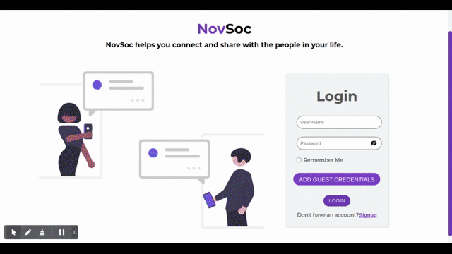

# NovSoc

NovSoc helps you connect and share with the people, share thoughts via posts and make a community.

---

## Key Features

- Auth Management
  - Login
  - Signup
  - Logout
- Posts Management
  - Crud on Posts
  - Text as well as Image Posts
  - User can checkout his feed as well as all posts
- Comments Management
  - Crud on Comments
- Like and Bookmark Management
  - User can Like/UnLike posts
  - User can Add / Remove a Post from Bookmarks
- User Profile Management
  - User can edit his Avatar, Bio and Website
- Sort Posts
  - Sort posts by Trending
  - Sort posts by newest as well as oldest added

---

## Built With

- React
- Redux Toolkit
- [NOVAUI](https://nova-ui.netlify.app/)
- React Router
- [Mockbee](https://mockbee.netlify.app/) - for backend
- [React Icons](https://react-icons.github.io/react-icons/)

---

## Folder Structure

```jsx
- /public
- /src
   - /assets
   - /backend
   - /components
   - /css
   - /hooks
   - /Pages
   - /redux
   - /services
   - /utils
   - App.css
   - App.js
   - index.js
   - RequiresAuth.js
   - server.js
- package-lock.json
- package.json
- README.md
- yarn.lock
```

---

## Contributing and How to Use

1. Fork the Project
2. Run npm install in the terminal
3. Run npm start to start the server on your local
4. Create your Feature Branch (git switch -c feature name)
5. Commit your Changes (git commit -m 'Add a descriptive commit message')
6. Push to the Branch (git push origin feature)
7. Open a Pull Request

---

## Desktop Version

<p align="center">
  
</p>
